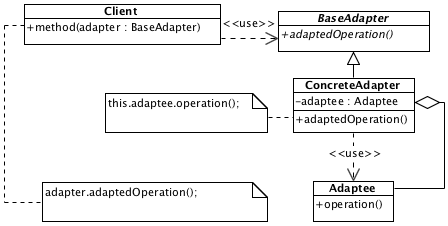

# Adapter

## Description

Client doesn't know about type of an adaptee and works with adapter only. Main responsibility of adapter is providing the correct interface of adaptee for the client.

## Diagram

## Sample code

* [Usage and tests](./../../test/adapter-tests.js)