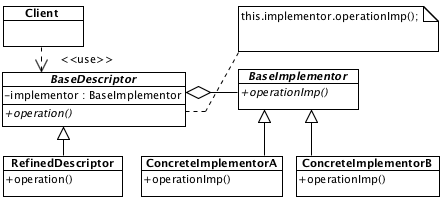

# Bridge

## Description

Between abstract descriptor and abstract implementor the bridge provides relationship which garants independent changes in future.

## Diagram

## Sample code

* [Usage and tests](./../../test/bridge-tests.js)