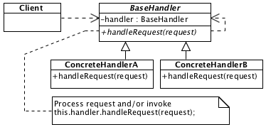

# Chain of Responsibility

## Description

Provides chain of object-handlers that processes object-request in consecutive order.

## Diagram

## Sample code

* [Usage and tests](./../../test/chainOfResponsibility-tests.js)