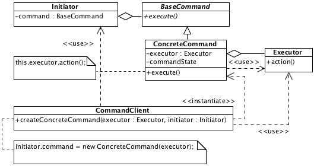

# Command

## Description

Defines object that stores information about command, preliminary validation, cancellation, etc. 

## Diagram

## Code

* [Source code](command.js)
* [Usage and tests](./../../test/command-tests.js)