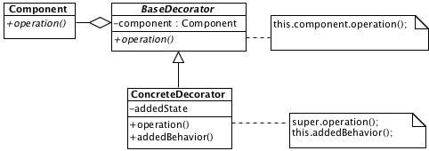

# Decorator

## Description

Decorator attaches additional behavior to the current component. This is an alternative to the inheritance and the mixins.

## Diagram

## Code

* [Source code](decorator.js)
* [Usage and tests](./../../test/decorator-tests.js)