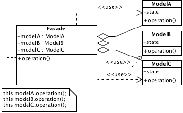

# Facade

## Description

Provides high-level interface of the subsystem. Objects in subsystem can interacts each other and don't know about the facade.

## Diagram

## Code

* [Source code](facade.js)
* [Usage and tests](./../../test/facade-tests.js)