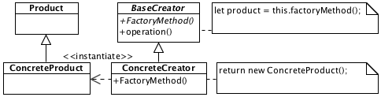

# Factory Method

## Description

Defines abstract method for object creating. This method can be overriden in child classes for object creating with concrete type.

## Diagram

## Sample code

* [Usage and tests](./../../test/factoryMethod-tests.js)