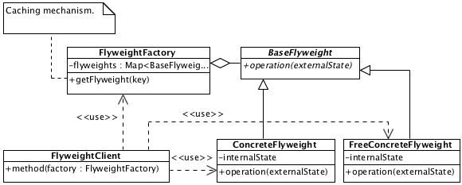

# Flyweight

## Description

Stores the part of internal state which using for calculations according to external state.

## Diagram

## Sample code

* [Usage and tests](./../../test/flyweight-tests.js)