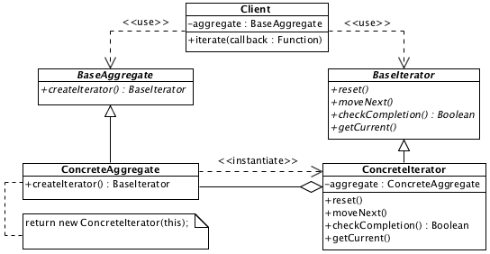

# Iterator

## Description

Allows access to the object-aggregate in consecutive order. Hides it internal realization.

## Diagram

## Sample code

* [Usage and tests](./../../test/iterator-tests.js)