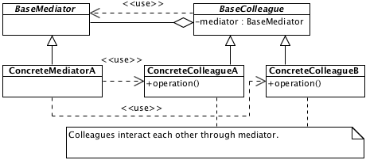

# Mediator

## Description

Provides mechanism for interactions between loosely-coupled objects.

## Diagram

## Code

* [Source code](mediator.js)
* [Usage and tests](./../../test/mediator-tests.js)