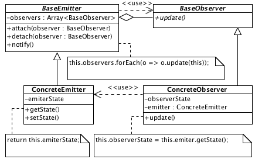

# Observer

## Description

Provides method of objects interaction, where an object-emitter contains references of the objects-observers. When the emiter changes, observers update through known interface.

## Diagram

## Code

* [Source code](observer.js)
* [Usage and tests](./../../test/observer-tests.js)