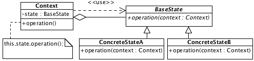

# State

## Description

Defines a subset of types for states. Objects of these types using in according state of object-context.

## Diagram

## Sample code

* [Usage and tests](./../../test/state-tests.js)