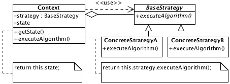

# Strategy

## Description

Defines the subset of interchangeable algorithms for context. Choice of concrete algorithm depends on external conditions.

## Diagram

## Code

* [Source code](strategy.js)
* [Usage and tests](./../../test/strategy-tests.js)