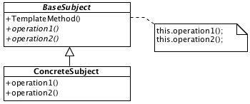

# Template Method

## Description

Defines method in base type which operates the other methods, creating some sort of base algorithm. These methods can (or must) be overriden in the subtype.

## Diagram

## Code

* [Source code](templateMethod.js)
* [Usage and tests](./../../test/templateMethod-tests.js)