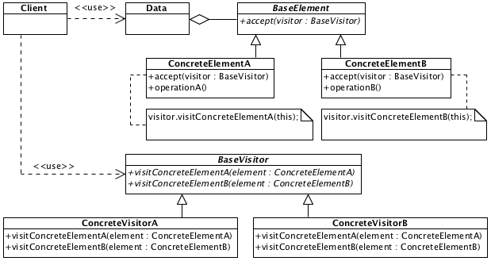

# Visitor

## Description

Defines one or more operations for certain class in separate class which can be used to extend it behaviour / change state / collect data / etc.

## Diagram

## Sample code

* [Usage and tests](./../../test/visitor-tests.js)